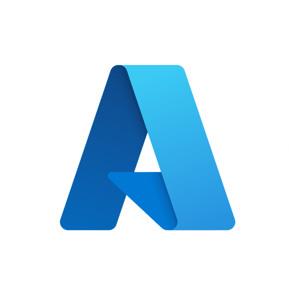

    
  <b>Microsoft Language Studio Overview</b>  
  <b>(language-studio-overview)</b>  

  Este projeto apresenta uma visão geral do Azure Language Studio, destacando suas principais funcionalidades, casos de uso e orientações práticas para criar e utilizar recursos de linguagem de forma eficiente.

  This project provides an overview of Azure Language Studio, highlighting its main features, use cases, and practical guidance for efficiently creating and utilizing language resources.

---

 
🇧🇷 Detalhes do Projeto (Português)

## Language Studio

- Ferramenta para criação de recursos de linguagem que permite:
  - Identificar idioma, sentimentos, frases-chave e entidades.

### Como criar um recurso no Language Studio

1. Acesse o portal do Azure.
2. Navegue até **IA/Machine Learning** e crie um **Serviço de Linguagem**.
3. Configure as opções: grupo de recursos, região, nível de preço (pricing tier) e finalize a criação.
4. Abra o serviço **Language Cognitive** no Azure e selecione o recurso criado.
5. Escolha a funcionalidade desejada, como **Classificação de Texto**.
6. Insira o texto ou faça upload de um arquivo e clique em **Run**.

**Próximas etapas:**
- **Introdução:** Aprenda como funciona e como utilizar.
- **Cenários comuns:** Explore exemplos de uso.
- **Serviços relacionados:** Integre com outros serviços.
- **Avaliação de custos:** Calcule o preço do serviço.
- **Uso responsável da IA:** Utilize a IA de forma ética e segura.

---

## Serviço de Bot do Azure

- Plataforma na nuvem para desenvolvimento e gerenciamento de bots.
- Oferece integração com **AI Language** e outros serviços.
- Permite conectividade por meio de múltiplos canais.

---

## Compreensão de Linguagem Coloquial

- Identifica:
  - **Enunciado:** O que foi dito.
  - **Entidade:** Elementos mencionados.
  - **Intenção:** O propósito da mensagem.

---

## Estúdio de Fala

- Ferramenta para transcrever texto em áudio ou áudio em texto.

### Como criar um novo recurso no Estúdio de Fala

1. Clique na engrenagem no canto superior direito e selecione **Criar novo recurso**.
2. Configure assinatura, região, grupo de recursos, entre outros.
3. Após criar, clique no recurso e selecione **Usar recurso**.
4. Na página inicial, vá até **Conversão de Fala em Texto** e escolha o serviço desejado.
5. Marque a opção para reconhecer o uso de OCR.
6. Selecione o idioma do arquivo e faça o upload.

**Próximas etapas:**
- **Introdução:** Entenda como funciona e como utilizar.
- **Cenários comuns:** Explore exemplos de uso.
- **Serviços relacionados:** Integre com outros serviços.
- **Avaliação de custos:** Calcule o preço do serviço.
- **Uso responsável da IA:** Utilize a IA de forma ética e segura.

---

## Language Studio

- Ferramenta para análise semântica de mensagens, permitindo:
  - Identificar idioma, sentimentos, frases-chave e entidades.

### Como criar um recurso no Language Studio

1. Acesse o portal do Azure.
2. Navegue até **IA/Machine Learning** e crie um **Serviço de Linguagem**.
3. Configure as opções: grupo de recursos, região, nível de preço (pricing tier) e finalize a criação.
4. Abra o serviço **Language Cognitive** no Azure e selecione o recurso criado.
5. Escolha a funcionalidade desejada, como **Classificação de Texto**.
6. Insira o texto ou faça upload de um arquivo e clique em **Run**.

**Próximas etapas:**
- **Introdução:** Aprenda como funciona e como utilizar.
- **Cenários comuns:** Explore exemplos de uso.
- **Serviços relacionados:** Integre com outros serviços.
- **Avaliação de custos:** Calcule o preço do serviço.
- **Uso responsável da IA:** Utilize a IA de forma ética e segura.

---

 
🇺🇸 Project Details (English)

## Language Studio

- A tool for creating language resources that allows:
  - Identifying language, sentiments, key phrases, and entities.

### How to Create a Resource in Language Studio

1. Access the Azure portal.
2. Navigate to **AI/Machine Learning** and create a **Language Service**.
3. Configure the options: resource group, region, pricing tier, and finalize the creation.
4. Open the **Language Cognitive** service in Azure and select the created resource.
5. Choose the desired functionality, such as **Text Classification**.
6. Enter the text or upload a file and click **Run**.

**Next Steps:**
- **Introduction:** Learn how it works and how to use it.
- **Common Scenarios:** Explore usage examples.
- **Related Services:** Integrate with other services.
- **Cost Evaluation:** Calculate the service cost.
- **Responsible AI Use:** Use AI ethically and safely.

---

## Azure Bot Service

- A cloud platform for developing and managing bots.
- Offers integration with **AI Language** and other services.
- Enables connectivity through multiple channels.

---

## Conversational Language Understanding

- Identifies:
  - **Utterance:** What was said.
  - **Entity:** Mentioned elements.
  - **Intent:** The purpose of the message.

---

## Speech Studio

- A tool for transcribing text to audio or audio to text.

### How to Create a New Resource in Speech Studio

1. Click the gear icon in the top-right corner and select **Create New Resource**.
2. Configure subscription, region, resource group, and other options.
3. After creation, click the resource and select **Use Resource**.
4. On the homepage, go to **Speech-to-Text Conversion** and choose the desired service.
5. Check the option to recognize OCR usage.
6. Select the file language and upload it.

**Next Steps:**
- **Introduction:** Understand how it works and how to use it.
- **Common Scenarios:** Explore usage examples.
- **Related Services:** Integrate with other services.
- **Cost Evaluation:** Calculate the service cost.
- **Responsible AI Use:** Use AI ethically and safely.

---

## Language Studio

- A tool for semantic analysis of messages, allowing:
  - Identifying language, sentiments, key phrases, and entities.

### How to Create a Resource in Language Studio

1. Access the Azure portal.
2. Navigate to **AI/Machine Learning** and create a **Language Service**.
3. Configure the options: resource group, region, pricing tier, and finalize the creation.
4. Open the **Language Cognitive** service in Azure and select the created resource.
5. Choose the desired functionality, such as **Text Classification**.
6. Enter the text or upload a file and click **Run**.

**Next Steps:**
- **Introduction:** Learn how it works and how to use it.
- **Common Scenarios:** Explore usage examples.
- **Related Services:** Integrate with other services.
- **Cost Evaluation:** Calculate the service cost.
- **Responsible AI Use:** Use AI ethically and safely.

---

## Licence

This software is licensed under the terms of the MIT License.

---

Developed by [Vitor Bittencourt](https://linktr.ee/vv_bittencourt) ☕

 